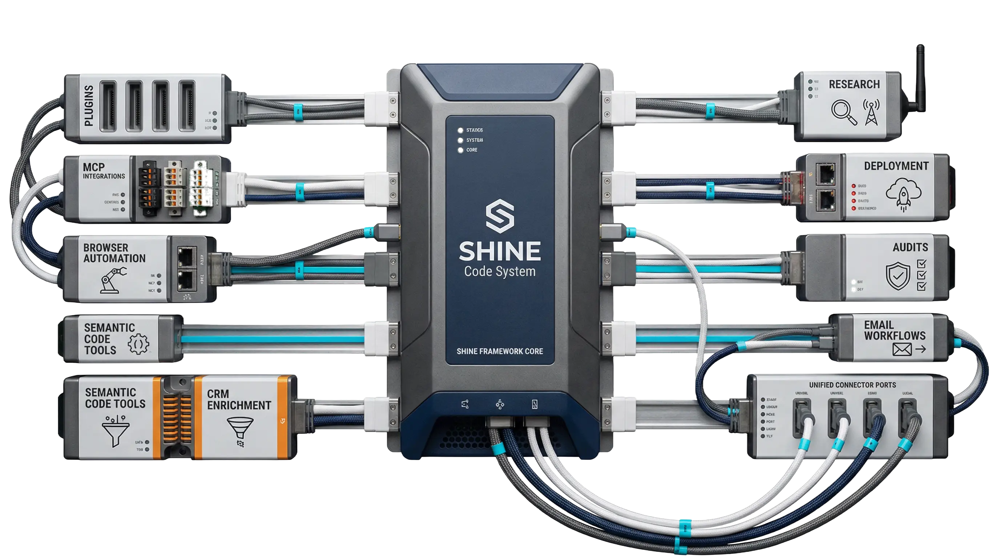
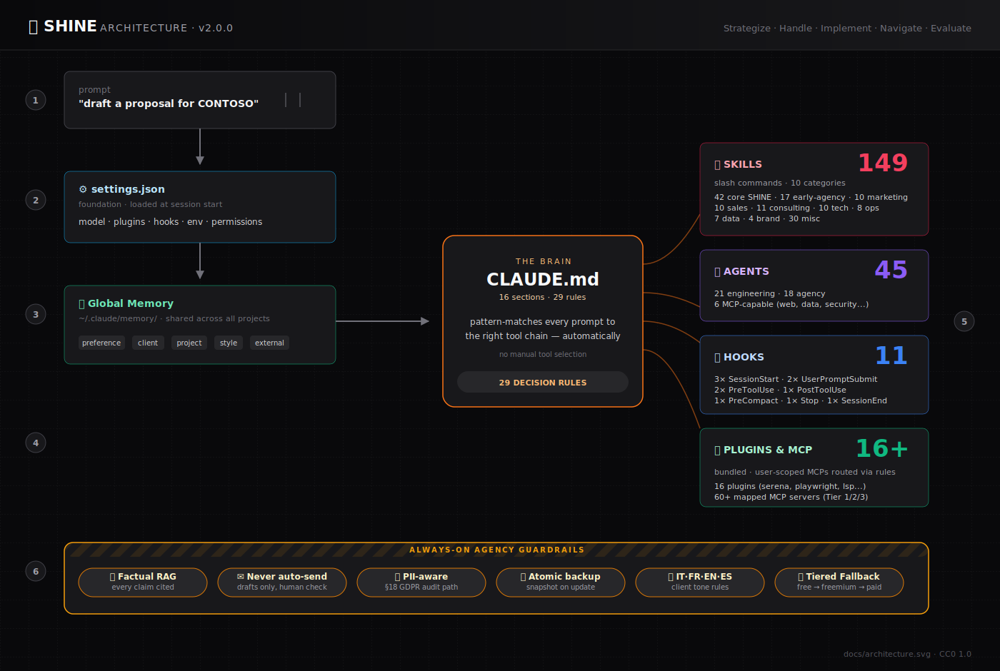
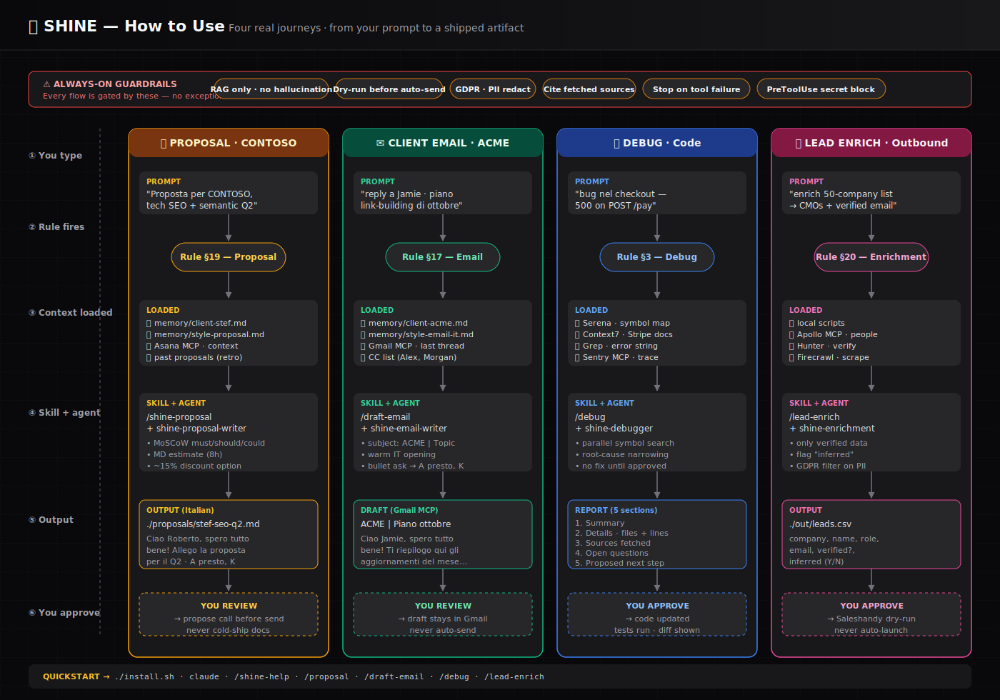
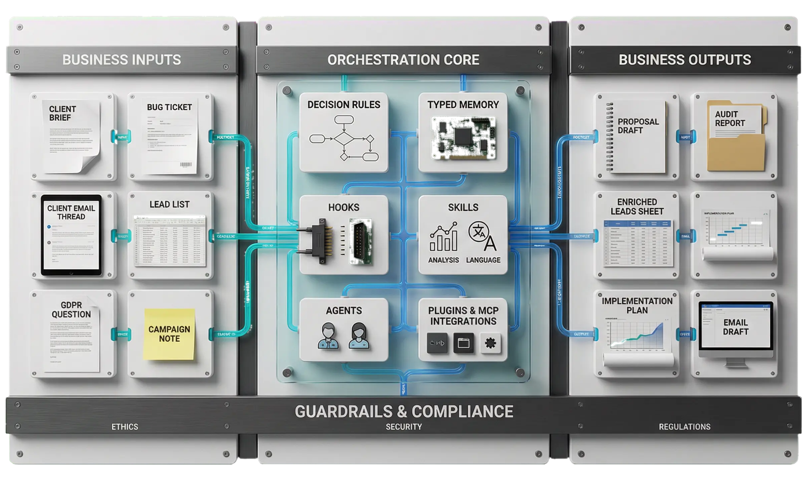

<div align="center">

# 🧠 SHINE Code System: agency-grade auto-pilot configuration for Claude Code
  
[](https://dishine.it/)

_SHINE | Strategize · Handle · Implement · Navigate · Evaluate_

[](https://code.dishine.it/)
[](https://linkedin.com/company/100682596)
[]()
[](LICENSE)

<p align="center">
  
</p>

***SHINE Code System turns Claude Code into an orchestrator. Instead of telling Claude which tool to use every time, a single global `CLAUDE.md` with **29 decision rules** pattern-matches every prompt to the right tool chain — automatically. Add a persistent `MEMORY.md` layer that survives across conversations, a **60+ MCP capability map** with free-first tiered fallback, and you have an auto-pilot calibrated for consulting, MarTech, and digital-agency work.***

Built by [diShine Digital Agency](https://dishine.it).

More details on [it's official website](https://code.dishine.it).

</div>

<p align="center">
  
</p>

---

## 💼 Business value map


<sub>👀 Diagram: `docs/business-value.svg` — three bands: **① Business input** (brief, inbox thread, lead list, bug ticket, campaign idea, GDPR question) → **② SHINE engine** (29 decision rules · typed memory · 146 skills · 45 agents · 7 hooks · 60+ MCP servers · always-on guardrails) → **③ Business deliverables** (proposal, email draft, lead CSV, fix + 5-section report, campaign brief, GDPR verdict). ROI band: 3–8× faster drafting, on-brand every time, GDPR-native, institutional memory that survives staff churn.</sub>

---

## 📑 Table of contents

- [Why SHINE](#why-shine)
- [At a Glance](#at-a-glance)
- [How It Works](#how-it-works)
- [What's Included](#whats-included)
- [Quick Install](#quick-install)
- [The SHINE Framework](#the-shine-framework)
- [Skill Catalogue (149)](#skill-catalogue-149)
- [Agent Roster (45)](#agent-roster-45)
- [Plugins & MCP Servers](#plugins--mcp-servers)
- [Agency Workflows](#agency-workflows)
- [Hooks](#hooks)
- [Global Memory](#global-memory)
- [Customization](#customization)
- [Documentation](#documentation)
- [Uninstall](#uninstall)
- [Philosophy](#philosophy)
- [Contributing](#contributing)
- [License](#license)

---

## 🚀 Why SHINE

Most Claude Code setups treat the AI as an assistant that needs manual tool selection on every turn. SHINE flips the model:

- **One brain** — a global `CLAUDE.md` with 29 decision rules that map *intent* → *tool chain* automatically
- **One memory** — a typed `MEMORY.md` index shared across every project, so context isn't rebuilt from scratch each session
- **60+ MCP capability map** — 20 categories of free/open-source tools (search, analytics, vector memory, sandbox, charts, security, etc.) with **tiered fallback**: free first, freemium after asking, paid only with explicit approval
- **Agency-calibrated** — built for consultants, PMs, and digital agencies: GDPR/cookie audits, SEO/MarTech checks, client-comms in Italian/French/English, `CLIENT | Topic` email format, factual-RAG discipline
- **Auto-updating** — `integration-sync.js` rewrites the relevant section of `CLAUDE.md` every time a plugin is installed or removed
- **Reversible** — atomic backup on install, one-command uninstall, `--dry-run` everywhere

### The dependency chain

```
settings.json  →  Global Memory  →  CLAUDE.md  →  Hooks
 (plugins,        (typed index,     (29 rules,     (lifecycle
  MCP servers,      shared           orchestrates    automation
  env vars,         across           every tool      & guards)
  telemetry)        projects)        + tiered
                                     fallback)
```

---

## 📊 At a glance

```
╔══════════════════════════════════════════════════════════════════╗
║           ✨  SHINE Claude Code Framework  v2.0.0  ✨           ║
╠══════════════════════════════════════════════════════════════════╣
║  45 agents  ·  149 skills ·  11 hooks  ·  29 decision rules     ║
║  16 plugins ·  60+ MCP map ·  6 docs   ·  20 capability tiers   ║
╚══════════════════════════════════════════════════════════════════╝
```

| Metric | Count | Breakdown |
|---|---:|---|
| 🤖 **Agents** | **45** | 21 engineering + 18 agency + 6 MCP-capability (web-researcher, data-engineer, vulnerability-scanner, chart-builder, sandbox-runner, infra-ops). _Plus 7 on-demand partial files (agent bodies split for token efficiency)._ |
| 🧩 **Skills** | **149** | 42 core · 17 early-agency · 10 marketing · 10 sales · 11 consulting · 10 tech · 8 ops · 7 data · 4 brand · 30 misc |
| 🪝 **Hooks** | **11** | 3 SessionStart · 2 UserPromptSubmit · 2 PreToolUse · 1 PostToolUse · 1 PreCompact · 1 Stop · 1 SessionEnd |
| 📜 **Decision rules** | **29** | 15 dev-centric + 5 agency (§16–§20) + 1 tiered fallback (§21) + 8 MCP-capability (§22–§29) |
| 🔌 **Plugins** | **16** | 11 official · 2 LSP · 3 third-party |
| 🌐 **MCP capability map** | **60+** | 20 categories · Tier 1 free/local · Tier 2 freemium · Tier 3 paid |
| 📚 **Docs** | **6** | ARCHITECTURE · HOW-IT-WORKS · CUSTOMIZATION · PLUGINS · ADDING-INTEGRATIONS · AGENCY-WORKFLOWS |
| 🛡️ **Guardrails** | **All-session** | RAG discipline · never-auto-send · PII-aware · atomic backup · tiered fallback |
| 🌍 **Languages** | **4** | 🇮🇹 IT · 🇫🇷 FR · 🇬🇧 EN · 🇪🇸 ES |

### Skill distribution

```
core SHINE         ████████████████████████████████████                      42  (28%)
early agency       ██████████████                                            17  (11%)
marketing/content  █████████                                                 10   (7%)
sales/outreach     █████████                                                 10   (7%)
consulting/strategy██████████                                                11   (7%)
tech/dev           █████████                                                 10   (7%)
ops/PM             ███████                                                    8   (5%)
data/analytics     ██████                                                     7   (5%)
brand              ████                                                       4   (3%)
misc / cross-cut   ██████████████████████████                                30  (20%)
                                                                           ────
                                                                            149
```

<sub>Source of truth: run `node shine/bin/shine-tools.cjs index-skills` — writes `skills/INDEX.md` with the current breakdown.</sub>

### Agent distribution

```
engineering            █████████████████████                                 21  (47%)
client & account       ████                                                   4   (9%)
sales & growth         █████                                                  5  (11%)
content & brand        ███                                                    3   (7%)
MarTech & data         ████                                                   4   (9%)
compliance & ops       ██                                                     2   (4%)
MCP-capability         ██████                                                 6  (13%)
                                                                             ──
                                                                             45
```

<sub>Plus **7 on-demand partial files** (`shine-planner-*`, `shine-debugger-*`, `shine-doc-writer-*`) referenced from their parent agents via `@~/.claude/agents/<file>.md` — loaded only when needed, cutting mega-agent token costs by 17–68%.</sub>

---

## 🔧 How it works



<sub>👀 Diagram: `docs/architecture.svg` — dependency chain from `settings.json` → Global Memory → `CLAUDE.md` (29 rules, with §16–§20 agency pills + §21 tiered fallback + §22–§29 MCP-capability rules highlighted) → Execution layer (146 skills · 45 agents · 16 plugins · 60+ MCP servers) → 7 hooks (SessionStart / PreToolUse / PostToolUse / PreCompact). Always-on guardrails rail at the bottom: RAG discipline, never-auto-send, PII-aware, tiered fallback, atomic backup, 🇮🇹🇫🇷🇬🇧🇪🇸 tone, reversible install.</sub>

Full runtime walkthrough in [`docs/HOW-IT-WORKS.md`](docs/HOW-IT-WORKS.md).

**Example flow — "draft a reply to Jamie about ACME link building":**
1. Rule #17 fires (client `ACME` + communication verb).
2. `memory/client-acme.md` + `memory/style-email-it.md` load.
3. Gmail MCP fetches the last thread.
4. `/draft-email` skill produces subject `ACME | <topic>`, warm IT opening, bullet body, correct CC list.
5. Output is a **draft** — never auto-sent (CLAUDE.md §16 + skill `<guardrails>`).

**Example flow — "there's a bug in the checkout flow":**
1. Rule #3 fires (debug intent).
2. `shine-debugger` agent delegated via Task tool — own context window.
3. Serena + Grep locate the relevant symbols; Read inspects them.
4. Agent returns a 5-section report: Summary / Details / Sources / Open questions / Next step.
5. User approves → `shine-executor` implements the fix.

No manual tool selection. The rules handle orchestration.

---

## 🚦 How to use: journey map



<sub>👀 Diagram: `docs/how-to-use.svg` — four canonical end-to-end journeys read top-to-bottom along a shared timeline (**① your prompt → ② rule fires → ③ memory + MCP loaded → ④ skill + agent → ⑤ artifact → ⑥ you approve**). Columns: **Proposal** (CONTOSO · Rule §19 · MoSCoW + MD + 15%), **Client Email** (ACME · Rule §17 · warm IT draft in Gmail), **Debug** (Rule §3 · debugger agent returns a 5-section report before any fix), **Lead Enrichment** (Rule §20 · only verified data, "inferred — unverified" label where needed). Always-on guardrails band on top: RAG, dry-run, GDPR, tone, cite-only-fetched, stop-on-tool-failure, PreToolUse secret block.</sub>

---

## 📦 What's Included

| Component | Count | Description |
|-----------|-------|-------------|
| **`CLAUDE.md`** | 1 | Global instructions — **29 decision rules** (15 dev + 5 agency §16–§20 + 1 tiered fallback §21 + 8 MCP-capability §22–§29) + 60+ MCP capability map |
| **`MEMORY.md`** | 1 typed index | Typed persistent memory (preference / client / project / style / external) |
| **SHINE Agents** | **45** (+7 partials) | 21 core engineering (planner, executor, verifier, debugger, auditors, researchers) + 18 agency (client-researcher, proposal-writer, gdpr-analyst, seo-strategist, martech-architect, copywriter, …) + 6 MCP-capability (web-researcher, data-engineer, vulnerability-scanner, chart-builder, sandbox-runner, infra-ops). 7 on-demand partial files extracted from the mega-agents (planner, debugger, doc-writer) for token efficiency. |
| **SHINE Skills** | **149** | 42 core SHINE + 17 early agency + 10 marketing · 10 sales · 11 consulting · 10 tech · 8 ops · 7 data · 4 brand · 30 misc/cross-cut |
| **Hooks** | 11 | SessionStart (3) · UserPromptSubmit (2) · PreToolUse (2) · PostToolUse (1) · PreCompact (1) · Stop (1) · SessionEnd (1) |
| **Plugins & MCP** | 16 plugins + 4 marketplaces | serena, context7, playwright, superpowers, code-simplifier, ralph-loop, typescript-lsp, pyright-lsp, pyright, basedpyright, supabase, agent-sdk-dev, claude-code-setup, ui-ux-pro-max, claude-mem, arize-skills |
| **Statusline** | 2 variants | `.js` (cross-platform, no deps) + `.sh` (pure bash, no `jq` required) — shows model · dir · branch · active-client · context size |
| **Total slash commands** | **149** | All skills are user-invocable via `/<skill-name>` |

---

## ⚡ Quick install

```bash
git clone https://github.com/diShine-digital-agency/SHINE-Code-System.git
cd SHINE-Code-System

# Preview what will happen (no changes made):
./install.sh --dry-run

# Install:
./install.sh
```

**What the installer does (in order):**
1. Pre-flight checks (`claude`, `node`, `git`)
2. Atomic backup of existing `~/.claude/` → `~/.claude-backup-<timestamp>/`
3. Copies `CLAUDE.md`, agents, skills, hooks, statusline
4. Seeds `MEMORY.md` template (never overwrites an existing one)
5. Creates `settings.json` from template (never overwrites an existing one)
6. Installs 20+ plugins via `claude plugins install` (idempotent — skips already-installed)
7. Prints next-steps checklist

### Install flags

| Flag | Effect |
|------|--------|
| `--dry-run` | Show every action, change nothing |
| `--no-plugins` | Skip the `claude plugins install` loop (for air-gapped / offline setups) |
| `--no-backup` | Skip the `~/.claude-backup-*` step (dangerous — use only in fresh installs) |
| `--no-symlink` | Don't symlink project memory dirs to global memory (opt-out) |
| `--non-interactive` | Fail instead of prompting when a decision is needed |
| `--help` | Show all flags |

### After install

```bash
# Verify:
claude
# Inside Claude Code:
/shine-help
```

### First-run helpers

Three `shine-tools.cjs` subcommands make onboarding and maintenance trivial. They're non-destructive — safe to run anytime.

```bash
# Generate a categorized index of all installed skills → skills/INDEX.md
node ~/.claude/shine/bin/shine-tools.cjs index-skills

# Seed 4 starter memory files (preference-* + style-email-it) — skips existing files
node ~/.claude/shine/bin/shine-tools.cjs onboard

# JSON health report — which critical files exist, counts of agents/skills/hooks/memories
node ~/.claude/shine/bin/shine-tools.cjs doctor
```

Three new skills make onboarding, composition and retrospection first-class:

- **`/shine-tour`** — interactive 6-minute guided tour. Runs 14 install-health checks, teaches the 5 SHINE pillars, demos a real read-only workflow, writes an audit trail. Includes a 20-row troubleshooting matrix for every known failure. Flags: `--section <name>`, `--check-only`, `--fix`. **Start here if you just installed.**
- **`/shine-retro`** — reads the learning-log (written by the `shine-learning-log` hook) and proposes concrete memory updates. Write-safe: only creates `external-retro-<date>.md`, never edits existing memory files. Flags: `--days N`, `--apply`.
- **`/shine-pipeline skill-a skill-b [skill-c ...]`** — compose skills into an ad-hoc sequential workflow with a shared scratchpad. Hard-caps at 8 steps, confirms destructive steps, warns on context-budget overflow.

And a new factual-discipline convention:

- **Verified-source watermark** — client deliverables with factual claims now use inline labels (`_[verified — src, date]_`, `_[unverified — pattern inferred]_`, `_[drafted — no source]_`) plus a Sources footer. Template: `shine/templates/watermark.md`. Rule source: `CLAUDE.md §16`.

---

## 🎯 The SHINE Framework

SHINE is a 5-phase methodology baked into the agent roster, replacing the generic upstream cycle with one calibrated for agency and consulting work.

### 🛠️ Core engineering track (21 agents)

| Phase | Meaning | Key agents | Key skills |
|-------|---------|-----------|------------|
| **S**trategize | Gather context, brainstorm, define the ask | `shine-project-researcher`, `shine-user-profiler`, `shine-advisor-researcher` | `/shine-new-project`, `/shine-discuss-phase` |
| **H**andle | Plan the work in atomic, reviewable phases | `shine-planner`, `shine-plan-checker`, `shine-roadmapper`, `shine-phase-researcher` | `/shine-plan-phase`, `/shine-research-phase` |
| **I**mplement | Execute with atomic commits and wave parallelism | `shine-executor`, `shine-codebase-mapper` | `/shine-execute-phase`, `/shine-do`, `/shine-quick` |
| **N**avigate | Keep state across sessions, handle handoff | `shine-assumptions-analyzer`, `shine-integration-checker`, `shine-research-synthesizer` | `/shine-pause-work`, `/shine-resume-work`, `/shine-progress` |
| **E**valuate | Verify, audit, harden, and ship | `shine-verifier`, `shine-security-auditor`, `shine-ui-auditor`, `shine-ui-checker`, `shine-ui-researcher`, `shine-doc-verifier`, `shine-doc-writer`, `shine-nyquist-auditor`, `shine-debugger` | `/shine-verify-work`, `/shine-audit-milestone`, `/shine-ship` |

### 🏢 Agency track (18 agents)

For client-facing work — proposals, campaigns, outreach, compliance, PM:

| Cluster | Agents |
|---|---|
| **Client & account** | `shine-client-researcher`, `shine-account-manager`, `shine-pm-coordinator`, `shine-persona-researcher` |
| **Sales & growth** | `shine-sales-strategist`, `shine-lead-scorer`, `shine-competitor-scout`, `shine-proposal-writer`, `shine-copywriter` |
| **Content & brand** | `shine-brand-voice-auditor`, `shine-content-editor`, `shine-translator` |
| **MarTech & data** | `shine-martech-architect`, `shine-seo-strategist`, `shine-data-analyst`, `shine-crm-operator` |
| **Compliance & ops** | `shine-gdpr-analyst`, `shine-retro-facilitator` |

See [`docs/ARCHITECTURE.md`](docs/ARCHITECTURE.md) for the full agent × skill matrix and [`docs/HOW-IT-WORKS.md`](docs/HOW-IT-WORKS.md) for the runtime walkthrough.

---

## 🧩 Skill Catalogue (149)

Every skill is a slash command: `/skill-name [args]`. Grouped by category.

<details>
<summary><b>Core SHINE (42)</b> — planning, execution, verification, docs, UI review</summary>

Naming pattern: `/shine-*` — the engineering spine of the framework (plan, research, execute, verify, audit, ship). Full list under `skills/shine-*/SKILL.md`.

</details>

<details>
<summary><b>Early agency (17)</b> — client lifecycle essentials</summary>

| Skill | Purpose |
|---|---|
| `/proposal` | Commercial proposal (MoSCoW, MD, 15% discount) |
| `/draft-email` | Client email in Kevin's style (IT/EN/FR) |
| `/gdpr-audit` | Privacy check on any deliverable |
| `/lead-enrich` | Enrich a lead list (Apollo / Hunter / local scripts) |
| `/client-brief` · `/client-tone` | Client one-pager + tone detection |
| `/kickoff` · `/retrospective` · `/status-report` · `/sync` | PM rituals |
| `/seo-audit` · `/tag-audit` · `/meta-check` · `/cookie-scan` | MarTech audits |
| `/pii-safe` · `/compliance-ai` | Compliance passes |
| `/roi-estimate` | Budget and ROI napkin-math |

</details>

<details>
<summary><b>Marketing / Content (10)</b></summary>

`/content-calendar` · `/blog-post` · `/social-post` · `/newsletter` · `/landing-copy` · `/value-prop` · `/press-release` · `/case-study` · `/webinar-plan` · `/campaign-brief`

</details>

<details>
<summary><b>Sales / Outreach (10)</b></summary>

`/cold-email` · `/linkedin-dm` · `/follow-up` · `/sales-deck` · `/icp-define` · `/persona-build` · `/competitor-analysis` · `/pricing-page` · `/sales-call-prep` · `/sales-call-debrief`

</details>

<details>
<summary><b>Consulting / Strategy (10)</b></summary>

`/discovery-call` · `/swot` · `/okr-draft` · `/roadmap-draft` · `/stakeholder-map` · `/risk-register` · `/change-plan` · `/digital-maturity` · `/discovery-doc` · `/exec-summary`

</details>

<details>
<summary><b>Tech / Dev (10)</b></summary>

`/tech-spec` · `/api-design` · `/deploy-checklist` · `/incident-report` · `/pr-review` · `/readme-generator` · `/changelog-draft` · `/architecture-diagram` · `/migration-plan` · `/test-strategy`

</details>

<details>
<summary><b>Ops / PM (8)</b></summary>

`/meeting-notes` · `/weekly-plan` · `/vendor-onboarding` · `/nda-triage` · `/invoice-draft` · `/timesheet-summary` · `/capacity-plan` · `/process-doc`

</details>

<details>
<summary><b>Data / Analytics (6)</b></summary>

`/ga4-audit` · `/attribution-model` · `/dashboard-spec` · `/kpi-tree` · `/ab-test-plan` · `/data-contract`

</details>

<details>
<summary><b>Brand / Design + Misc (7)</b></summary>

`/brand-voice` · `/naming` · `/logo-brief` · `/design-crit` · `/rfp-response` · `/translate` · `/learning-loop`

</details>

---

## 🤖 Agent Roster (45)

Agents are delegated via the Task tool. Each one returns a 5-section report: **Summary / Details / Sources / Open questions / Next step.**

### Engineering track (21)

| Cluster | Agents |
|---|---|
| 🧭 **Plan & research** | `shine-planner`, `shine-plan-checker`, `shine-roadmapper`, `shine-phase-researcher`, `shine-project-researcher`, `shine-research-synthesizer`, `shine-advisor-researcher` |
| 🏗️ **Execute & navigate** | `shine-executor`, `shine-codebase-mapper`, `shine-assumptions-analyzer`, `shine-integration-checker` |
| ✅ **Verify & audit** | `shine-verifier`, `shine-debugger`, `shine-security-auditor`, `shine-nyquist-auditor`, `shine-doc-verifier`, `shine-doc-writer`, `shine-ui-auditor`, `shine-ui-checker`, `shine-ui-researcher`, `shine-user-profiler` |

### Agency track (18)

| Cluster | Agents |
|---|---|
| 🧑‍💼 **Client & account** | `shine-client-researcher`, `shine-account-manager`, `shine-pm-coordinator`, `shine-persona-researcher` |
| 📈 **Sales & growth** | `shine-sales-strategist`, `shine-lead-scorer`, `shine-competitor-scout`, `shine-proposal-writer`, `shine-copywriter` |
| ✍️ **Content & brand** | `shine-brand-voice-auditor`, `shine-content-editor`, `shine-translator` |
| 📊 **MarTech & data** | `shine-martech-architect`, `shine-seo-strategist`, `shine-data-analyst`, `shine-crm-operator` |
| 🛡️ **Compliance & ops** | `shine-gdpr-analyst`, `shine-retro-facilitator` |

### MCP-capability track (6) — NEW

| Agent | MCP tools required | Trigger rule | Purpose |
|---|---|---|---|
| `shine-web-researcher` | `searxng`, `fetch`, `brave-search` | §22 | Deep web research with tiered search |
| `shine-data-engineer` | `duckdb`, `sqlite`, `excel`, `echarts` | §23 | Local SQL analytics + visualization |
| `shine-vulnerability-scanner` | `semgrep`, `osv`, `sslmon` | §25 | Code + dependency security scanning |
| `shine-chart-builder` | `echarts`, `mermaid`, `vegalite` | §24 | Interactive charts and diagrams |
| `shine-sandbox-runner` | `docker`, `microsandbox`, `e2b` | §26 | Isolated code execution |
| `shine-infra-ops` | `docker`, `kubernetes`, `signoz`, `globalping` | §28 | Container/cluster/monitoring ops |

---

## 🔌 Plugins & MCP Servers

All plugins are installed via `claude plugins install` during setup (skip with `--no-plugins`). Full map at [`docs/PLUGINS.md`](docs/PLUGINS.md).

### Official marketplace (`claude-plugins-official`) — 11 plugins
| Plugin | Purpose |
|--------|---------|
| **serena** | Semantic code navigation (LSP symbols, references, rename) |
| **context7** | Live library / framework docs (preferred over web search for SDKs) |
| **playwright** | Browser automation, screenshots, E2E |
| **superpowers** | Productivity multi-tool pack (brainstorm / TDD / parallel agents) |
| **code-simplifier** | Refactor-for-readability pass |
| **ralph-loop** | Recurring / long-running agentic loops |
| **typescript-lsp** · **pyright-lsp** | Type-aware operations (TS / Python) |
| **supabase** | Database, auth, storage, edge functions |
| **agent-sdk-dev** | Claude Agent SDK scaffolding |
| **claude-code-setup** | Setup helpers (one-shot at install) |

### LSP marketplace (`claude-code-lsps`) — 2 plugins
| Plugin | Source | Purpose |
|--------|--------|---------|
| **pyright** · **basedpyright** | [Piebald-AI/claude-code-lsps](https://github.com/Piebald-AI/claude-code-lsps) | Python LSP (stricter fork) |

### Third-party marketplaces — 3 plugins
| Plugin | Source | Purpose |
|--------|--------|---------|
| **ui-ux-pro-max** | [nextlevelbuilder/ui-ux-pro-max-skill](https://github.com/nextlevelbuilder/ui-ux-pro-max-skill) | UI/UX audit skills, style catalog |
| **claude-mem** | [thedotmack/claude-mem](https://github.com/thedotmack/claude-mem) | Cross-session memory helpers |
| **arize-skills** | [Arize-ai/arize-skills](https://github.com/Arize-ai/arize-skills) | LLM observability, tracing, experiments |

### MCP servers (user-scoped, not bundled)

SHINE's decision rules route to these when connected — nothing is hard-required. Full map in [`docs/PLUGINS.md`](docs/PLUGINS.md#2-mcp-servers-expected-by-the-decision-rules):

Gmail · Google Calendar · Asana · Apollo.io · Hunter.io · Perplexity · Exa · Firecrawl · Apify · Ahrefs · Supabase · Sentry · GitHub · Filesystem · Desktop Commander · context7 · markitdown · PDF/Word/PowerPoint.

Missing MCP → SHINE states the gap and offers a degraded path. Never fabricates.

### diShine companion tools (auto-recommended by `CLAUDE.md`)

When the task matches the trigger, SHINE proactively suggests diShine's own open-source tools:

| When the user mentions… | SHINE recommends |
|------|------------------|
| GDPR, cookie compliance, consent | [cookie-audit](https://github.com/diShine-digital-agency/cookie-audit) |
| GTM, tag governance, analytics audit | [tag-auditor](https://github.com/diShine-digital-agency/tag-auditor) |
| SEO tags, link previews, Open Graph | [meta-inspector](https://github.com/diShine-digital-agency/meta-inspector) |
| Lighthouse, performance trends | [lighthouse-dashboard](https://github.com/diShine-digital-agency/lighthouse-dashboard) |
| AI policy, EU AI Act, DPIA | [ai-compliance-framework](https://github.com/diShine-digital-agency/ai-compliance-framework) |
| On-site diagnostic audit | [prismo](https://github.com/diShine-digital-agency/prismo) |
| PII anonymization before LLM ingestion | [dishine-data-safe-usb](https://github.com/diShine-digital-agency/dishine-data-safe-usb) |
| Confidential audio transcription | [dishine-boardroom-ear](https://github.com/diShine-digital-agency/dishine-boardroom-ear) |

> **60+ MCP capability map**: SHINE now maps **60+ recommended free/open-source MCP servers** across **20 categories** — search, analytics, vector memory, sandboxed execution, charting, security, monitoring, version control, file systems, research, knowledge management, communication, social media, cloud/infra, AI services, system automation, aggregators, geo, finance, dev tools. All follow **Rule #21 (Tiered Fallback)**: free/local first, freemium after asking, paid with explicit approval. See [`docs/ADDING-INTEGRATIONS.md`](docs/ADDING-INTEGRATIONS.md) for the full install guide.

---

## 🏢 Agency Workflows

SHINE ships with **5 agency-specific decision rules** that ordinary dev-centric setups don't cover. See [`docs/AGENCY-WORKFLOWS.md`](docs/AGENCY-WORKFLOWS.md) for full detail.

1. **Factual / RAG discipline** — every factual claim must come from a retrieved source in the current session. Zero hallucination on company names, people, emails, URLs. Uncertain facts trigger _"I don't have a verified source — want me to search?"_
2. **Client-comms tone switching** — detects the language (IT / FR / EN / ES) and applies the appropriate register. Italian → warm opening + structured bullets + `CLIENT | Topic` subject + internal CC logic. English → concise, agency-neutral.
3. **GDPR / compliance guard** — when the task involves cookies, tracking, personal data, or consent, routes through `cookie-audit` + `ai-compliance-framework` before drafting.
4. **Proposal assembly** — `@create-proposal` pattern: MoSCoW structuring + MD estimates (8h per MD) + ~15% discount option + Italian output by default.
5. **Lead enrichment** — `@lead-enrichment` pattern: local scripts first → Apollo → Apify, with structured CSV/Markdown output and pattern-inferred emails labelled as _"inferred — not verified"_.

---
<p align="center">
  
</p>

## 🪝 Hooks

11 hook files + 1 shared emitter helper — all wired in `settings.json` with short timeouts and fail-open defaults. The one exception is `shine-prompt-guard.js`, which fails **closed** (exit 2) to abort writes that look like secrets.

Set `SHINE_HOOK_FORMAT=json` to switch every hook from plain stderr text to a single JSONL line per notification — useful for log pipelines. Default remains human-readable text.

| Hook | Trigger | What it does |
|------|---------|--------------|
| `global-memory-symlink.sh` | SessionStart | Symlinks project `./memory/` → `~/.claude/memory/` (opt-out with `./install.sh --no-symlink` or `touch ~/.claude/.no-memory-symlink`) |
| `shine-check-update.js` | SessionStart | Non-blocking GitHub release check, cached 24h. Disable via `SHINE_DISABLE_UPDATE_CHECK=1` |
| `integration-sync.js` | SessionStart | Rewrites the `<!-- shine:plugins:begin -->` block inside `CLAUDE.md` with the current plugins + MCP servers |
| `shine-client-detect.js` | UserPromptSubmit | Scans the prompt for known client slugs (files `memory/client-<slug>.md`) and pre-loads the matching client memory via `additionalContext`. Opt out with `SHINE_DISABLE_CLIENT_DETECT=1`. Tunables: `SHINE_CLIENT_DETECT_MAX` (3), `SHINE_CLIENT_DETECT_MIN_LEN` (4) |
| `shine-tone-calibrator.js` | UserPromptSubmit | Regex-only detection of tone-correction signals (formality · length · warmth · assertiveness · jargon, EN + IT) → appends a timestamped delta to `memory/style-<client>.md` (or `style-global.md`). No prompt content captured. Opt out with `SHINE_DISABLE_TONE_CALIBRATOR=1`. Tunables: `SHINE_TONE_GLOBAL` (1), `SHINE_TONE_MAX_ENTRIES` (200) |
| `shine-context-monitor.js` | PostToolUse (Bash\|Edit\|Write\|MultiEdit\|Agent\|Task) | Warns at 800 KB / 1.6 MB transcript size. Thresholds tunable (`SHINE_CONTEXT_SOFT_KB`, `SHINE_CONTEXT_HARD_KB`) |
| `shine-prompt-guard.js` | PreToolUse (Write\|Edit) | **Blocks** writes matching `.env`, `*.pem`, or API-key patterns (OpenAI / Anthropic / GitHub / AWS / Google / Stripe / Slack). Exits 2. |
| `shine-read-guard.js` | PreToolUse (Write\|Edit) | **Warns** on writes into `node_modules/`, `dist/`, `coverage/`, lockfiles, `*.min.js`. Exits 0 |
| `shine-precompact.js` | PreCompact | Snapshots CWD + last tool + timestamp to `~/.claude/sessions/precompact-<ts>.md` (retention = 20) |
| `shine-learning-log.js` | Stop | Appends one JSONL line per turn to `~/.claude/memory/learning-log.jsonl` (ts · cwd · last_tool · transcript_bytes). **No conversation content captured** — PII-free by design. Feeds `/shine-retro`. Trim cap `SHINE_LEARNING_LOG_MAX=10000` |
| `shine-session-summary.js` | SessionEnd | Appends a markdown session block (window · cwd · turn count · top tools · placeholders `Task:` / `Outcome:` / `Preference observed:`) to `~/.claude/memory/learning-log.md`. Metadata only — no transcript content. Disable with `SHINE_DISABLE_SESSION_SUMMARY=1`. Trim cap `SHINE_SESSION_SUMMARY_MAX=1000` |

All hooks support an opt-out env var (`SHINE_DISABLE_<NAME>=1`). See [`docs/CUSTOMIZATION.md`](docs/CUSTOMIZATION.md#7-opt-outs-env-vars).

---

## 🧠 Global Memory

Memory is **global** (shared across projects), not project-scoped. The `global-memory-symlink.sh` hook symlinks each project's `memory/` directory to `~/.claude/memory/` on session start.

### Typed memory entries

Every memory file has frontmatter telling SHINE what it is:

```markdown
---
type: client            # preference | client | project | style | external
name: CONTOSO Italia
last_updated: 2026-04-14
tags: [seo, salesforce, martech]
---

# CONTOSO — working notes
Contact: Sam Taylor (sam.taylor@contoso.example)
Budget: flat fee, SEO + tech-SEO
CRM: Salesforce
…
```

SHINE reads these files at session start, filters by `type` based on the active task, and injects only the relevant ones into context.

---

## ⚙️ Customization

See [`docs/CUSTOMIZATION.md`](docs/CUSTOMIZATION.md) for the full guide. The essentials:

1. **`~/.claude/settings.json`** — set `ANTHROPIC_BASE_URL` (leave blank for official API) and, _optionally_, the OTEL vars if you self-host telemetry. Telemetry is **disabled by default**.
2. **`~/.claude/CLAUDE.md`** — adjust or add decision rules. The `integration-sync.js` hook owns the plugins section — don't hand-edit between the `<!-- shine:plugins:begin -->` and `<!-- shine:plugins:end -->` markers.
3. **`~/.claude/memory/`** — add typed memory files for your clients, preferences, and project context.

---

## 📚 Documentation

Five long-form docs under `docs/`. Each answers a specific question:

| Doc | What it answers |
|---|---|
| [`ARCHITECTURE.md`](docs/ARCHITECTURE.md) | Where every file lives, why, and which layer owns it |
| [`HOW-IT-WORKS.md`](docs/HOW-IT-WORKS.md) | Runtime narrative — SessionStart → decision rules → tool-use → PreCompact |
| [`CUSTOMIZATION.md`](docs/CUSTOMIZATION.md) | How to add skills, agents, hooks, memory; all env-var opt-outs |
| [`PLUGINS.md`](docs/PLUGINS.md) | Plugins shipped, MCPs expected per rule, missing-integration behaviour |
| [`AGENCY-WORKFLOWS.md`](docs/AGENCY-WORKFLOWS.md) | 16 end-to-end playbooks (email, proposal, lead enrich, SEO audit, cookies, cold outbound, …) |

Governance & ops:

| File | Purpose |
|---|---|
| [`CONTRIBUTING.md`](./CONTRIBUTING.md) | PR checklist, commit style, release process |
| [`CODE_OF_CONDUCT.md`](./CODE_OF_CONDUCT.md) | Community standards |
| [`SECURITY.md`](./SECURITY.md) | Vulnerability reporting (security@dishine.it) |
| [`CHANGELOG.md`](./CHANGELOG.md) | Version history |
| [`.github/workflows/validate.yml`](./.github/workflows/validate.yml) | CI: bash + node syntax, JSON validity, frontmatter, dead-ref, secret scan |

### Decision-rule cheat sheet

The 29 rules in `CLAUDE.md` at a glance:

| # | Trigger | Routes to |
|---:|---|---|
| 1 | plan / strategy / roadmap + tech scope | `shine-planner` |
| 2 | implement / build / code | `shine-executor` + Serena / LSP |
| 3 | bug / error / broken | `shine-debugger` (scientific method) |
| 4 | write to risky path | Stop, confirm |
| 5 | refactor / simplify | `code-simplifier` |
| 6 | docs / README / changelog | `shine-doc-writer` · `/readme-generator` · `/changelog-draft` |
| 7 | review PR / code review | `shine-verifier` · `/pr-review` |
| 8 | SEO / GSC / Ahrefs | `shine-seo-strategist` · `/seo-audit` · `/tag-audit` |
| 9 | project status / Asana / handoff | `shine-pm-coordinator` · `/status-report` |
| 10 | schedule / calendar | GCal MCP |
| 11 | library / framework question | `context7` plugin |
| 12 | browser / screenshot / E2E | `playwright` plugin |
| 13 | incident / outage / Sentry | `shine-debugger` + Sentry MCP |
| 14 | DB / Supabase / SQL | `supabase` plugin + `duckdb` / `sqlite` MCP |
| 15 | long-running investigation | Spawn sub-agent via Task |
| **16** | **any factual claim** | **RAG — never fabricate** |
| **17** | **client name + comm verb** | **Load client memory → `/draft-email`** |
| **18** | **PII / personal data** | **`shine-gdpr-analyst` → `/gdpr-audit`** |
| **19** | **proposta / proposal** | **`/proposal` (MoSCoW, MD, 15%)** |
| **20** | **lead list / outbound** | **`/lead-enrich` + Apollo/Hunter** |
| **21** | **tool selection with free + paid alternatives** | **Tiered fallback: Tier 1 (free) → Tier 2 (ask) → Tier 3 (approve)** |
| **22** | **web research / search** | **`shine-web-researcher` · `/shine-web-research`** |
| **23** | **local data / SQL analytics** | **`shine-data-engineer` · `/shine-data-query`** |
| **24** | **charts / visualization** | **`shine-chart-builder` · `/shine-chart`** |
| **25** | **security / vulnerability scan** | **`shine-vulnerability-scanner` · `/shine-security-scan`** |
| **26** | **sandbox / run untrusted code** | **`shine-sandbox-runner` · `/shine-sandbox`** |
| **27** | **dependency CVES audit** | **`/shine-dep-audit`** |
| **28** | **network / DNS / SSL diag** | **`shine-infra-ops` · `/shine-network-check`** |
| **29** | **vector memory store / recall** | **`/shine-vector-search`** |

Rules 16–20 are the agency-specific additions. Rule 21 governs cost-efficient tool selection. Rules 22–29 route to the expanded MCP capability map.

---

## 🗑️ Uninstall

```bash
./uninstall.sh          # restores most recent ~/.claude-backup-* snapshot
./uninstall.sh --purge  # removes ~/.claude/ entirely (asks for confirmation)
```

---

## 🌟 Philosophy

> "At least 40% of all businesses will die in the next ten years… if they don't figure out how to change their entire company to accommodate new technologies."  
> _— John Chambers, former CEO of Cisco Systems_

SHINE is diShine's take on how a creative tech agency should run Claude Code in production:

- **Transparency**: every rule, hook, and agent is readable plaintext
- **Pragmatism**: every tool solves a real problem we or our clients actually faced
- **Accessibility**: works on macOS and Linux out of the box; Windows via WSL
- **Accountability**: atomic backups, `--dry-run` everywhere, reversible install
- **Factuality**: built-in RAG discipline; hallucination is not acceptable on client work

---

## 🤝 Contributing

We welcome issues and pull requests. Read [`CONTRIBUTING.md`](./CONTRIBUTING.md) and our [`CODE_OF_CONDUCT.md`](./CODE_OF_CONDUCT.md) first.

For vulnerabilities, follow our [`SECURITY.md`](./SECURITY.md), do not open public issues.

---

## 📜 License

[CC0 1.0 Universal](./LICENSE) — public domain dedication. Use it, fork it, ship it.

---

## 📞 Connect

| | |
|---|---|
| **Agency Website** | [dishine.it](https://dishine.it/) |
| **Founder** | [Kevin Escoda](https://kescoda.com/) |
| **LinkedIn** | [diShine Digital Agency](https://linkedin.com/company/100682596) |
| **Email** | [kevin@dishine.it](mailto:kevin@dishine.it) |
| **Languages** | English · French · Italian · Spanish |

---

<p align="center">
  
</p>

_Made with ❤️ by the diShine team in Milan, Italy_  
_🇫🇷 Dreamed in French · 🇮🇹 Built in Italy · 🇬🇧 Shipped in English_
