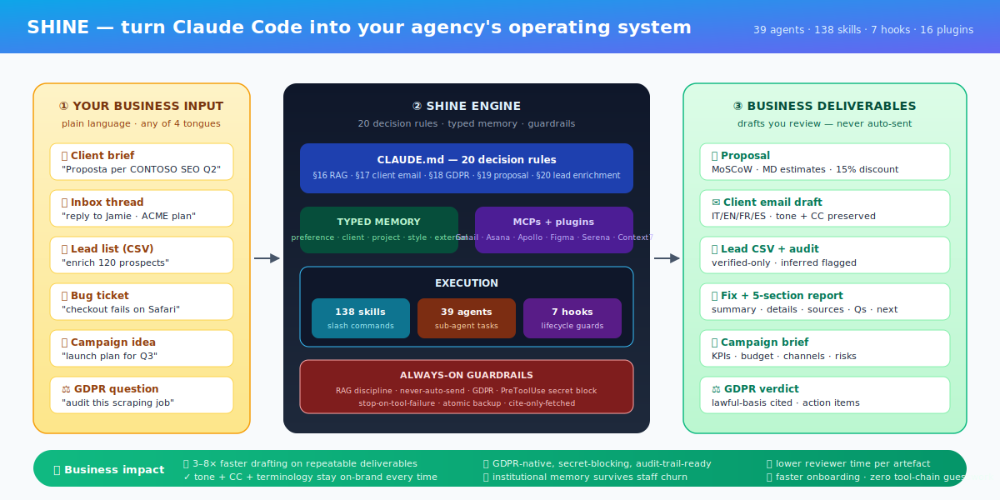

# SHINE — Architecture (v2 — Extended Capabilities)

This doc explains **how the SHINE Claude Code Framework is organized on disk and at runtime.** If you want a higher-level walkthrough of what happens during a session, see [HOW-IT-WORKS.md](./HOW-IT-WORKS.md).



<sub>Business-view companion: input → engine → deliverables, with always-on guardrails and ROI framing. Use this when explaining SHINE to stakeholders who don't need the on-disk details below.</sub>

---

## 1. On-disk layout

After `./install.sh`, `~/.claude/` looks like this:

```
~/.claude/
├── CLAUDE.md                 # Global instructions — 21 decision rules, tone, RAG discipline, tiered fallback
├── settings.json             # User-editable config (model, hooks, plugins, MCP, env)
├── statusline.js             # Default statusline renderer (Node)
├── statusline.sh             # Pure-bash fallback (no Node, no jq required)
├── agents/                   # 39 agent .md files — invoked via the Task tool
├── skills/                   # 139 skill directories — each has SKILL.md + optional scripts
├── hooks/                    # 7 hook scripts — SessionStart / PreToolUse / PostToolUse / PreCompact
├── memory/                   # Typed persistent memory (preference | client | project | style | external)
├── sessions/                 # Volatile session state (precompact snapshots, active-client)
├── projects/                 # Per-project transcripts (Claude Code writes these)
├── tasks/ teams/ todos/      # Claude Code internal state
├── debug/ backups/ cache/    # Support dirs
└── shine/VERSION             # Framework version marker (for update checks)
```
```

**Reversibility.** `install.sh` takes an atomic snapshot of any existing `~/.claude/` into `~/.claude-backup-<timestamp>/` before writing anything. `./uninstall.sh` restores the most recent snapshot; `./uninstall.sh --purge` wipes `~/.claude/` entirely with a typed confirmation.

---

## 2. Runtime layers

```
┌──────────────────────────────────────────────────────────────┐
│  User prompt                                                 │
└───────────────┬──────────────────────────────────────────────┘
                │
                ▼
┌──────────────────────────────────────────────────────────────┐
│  CLAUDE.md — 21 decision rules + Rule #21 (Tiered Fallback)   │
│  Pattern-match the prompt → route to agent / skill / tool     │
└───────────────┬──────────────────────────────────────────────┘
                │
   ┌────────────┼────────────┬─────────────┬──────────────┐
   ▼            ▼            ▼             ▼              ▼
 Skills       Agents      Plugins       MCP           Hooks
 (slash       (Task       (serena,      servers       (Session*,
 commands)    subagents)  context7…)    (60+ avail,   Pre/Post
                                        tiered:       ToolUse,
                                        free first)   PreCompact)
```

### 2.1 CLAUDE.md is the router

The 21 decision rules in `CLAUDE.md` are literal pattern-to-action mappings. Rule #21 is special — it governs **tool tier resolution** whenever multiple tools can serve the same function (free first, then freemium after asking, then paid with explicit approval). Example:

> **Rule 17** — When the prompt contains a client name from `memory/*client-*.md` and a communication verb (reply, draft, follow up), load the matching `type: client` memory file + `style-email-*.md`, then run the `draft-email` skill.

This is what makes the framework feel "smart": the routing is in plain Markdown, inspectable and editable by the user.

### 2.2 Agents (39)

`agents/*.md` files. Each one has:

- **Frontmatter**: `name`, `description`, `tools`, `color`
- `<role>`: mission statement
- `<approach>`: numbered workflow
- `<anti_patterns>`: explicit don'ts
- `<output_format>`: enforces the 5-section report — **Summary · Details · Sources · Open questions · Next step**

Two groups:

1. **Core engineering agents (21)** — `shine-planner`, `shine-executor`, `shine-verifier`, `shine-security-auditor`, `shine-debugger`, `shine-codebase-mapper`, `shine-advisor-researcher`, `shine-roadmapper`, `shine-ui-auditor`, etc.
2. **Agency agents (18)** — `shine-client-researcher`, `shine-proposal-writer`, `shine-gdpr-analyst`, `shine-brand-voice-auditor`, `shine-competitor-scout`, `shine-seo-strategist`, `shine-martech-architect`, `shine-copywriter`, `shine-translator`, `shine-account-manager`, `shine-pm-coordinator`, `shine-crm-operator`, `shine-lead-scorer`, `shine-persona-researcher`, etc.

### 2.3 Skills (139)

`skills/<name>/SKILL.md` + optional scripts. Skills are **user-invocable slash commands** (`/skill-name args`). Each SKILL.md has:

- Frontmatter: `name`, `description`, `argument-hint`, `allowed-tools`
- `<objective>`: what the skill produces
- `<guardrails>`: factual discipline, language detection, never-auto-send

Eight categories:

| Category | Count | Examples |
|---|---|---|
| Core SHINE (renamed from upstream) | 61 | `shine-review`, `shine-plan`, `shine-verify`, `shine-debug`, `shine-doc`, … |
| Early agency | 17 | `proposal`, `draft-email`, `gdpr-audit`, `lead-enrich`, `client-brief`, `kickoff` |
| Marketing / Content | 10 | `content-calendar`, `blog-post`, `newsletter`, `landing-copy`, `value-prop` |
| Sales / Outreach | 10 | `cold-email`, `linkedin-dm`, `sales-deck`, `icp-define`, `pricing-page` |
| Consulting / Strategy | 10 | `discovery-call`, `swot`, `okr-draft`, `roadmap-draft`, `exec-summary` |
| Tech / Dev | 10 | `tech-spec`, `api-design`, `deploy-checklist`, `pr-review`, `migration-plan` |
| Ops / PM | 8 | `meeting-notes`, `weekly-plan`, `nda-triage`, `invoice-draft`, `capacity-plan` |
| Data / Analytics | 6 | `ga4-audit`, `attribution-model`, `kpi-tree`, `ab-test-plan`, `data-contract` |
| Brand / Design + Misc | 7 | `brand-voice`, `naming`, `logo-brief`, `rfp-response`, `translate`, `learning-loop` |

### 2.4 Hooks (7)

Listed in `settings.template.json` and installed to `~/.claude/hooks/`:

| Hook | Trigger | Purpose |
|---|---|---|
| `global-memory-symlink.sh` | SessionStart | Symlink `./memory/` → `~/.claude/memory/` so project sessions share typed memory |
| `shine-check-update.js` | SessionStart | Non-blocking GitHub release check, cached 24h |
| `integration-sync.js` | SessionStart | Refresh the auto-sync block inside `CLAUDE.md` with current plugins + MCP servers |
| `shine-context-monitor.js` | PostToolUse (Bash\|Edit\|Write\|MultiEdit\|Agent\|Task) | Warn when transcript approaches compact threshold |
| `shine-prompt-guard.js` | PreToolUse (Write\|Edit) | **Blocks** writes that look like secrets (.env, API keys, PEM, JWT-shaped) — exits 2 |
| `shine-read-guard.js` | PreToolUse (Write\|Edit) | **Warns** on writes into `node_modules/`, `dist/`, lockfiles, etc. — exits 0 |
| `shine-precompact.js` | PreCompact | Snapshot of last tool + CWD + timestamp to `~/.claude/sessions/precompact-*.md` |

Every hook exits 0 on failure except `shine-prompt-guard.js`, which exits 2 to abort the offending tool call. Opt-outs via env vars (`SHINE_DISABLE_*`).

### 2.5 Plugins & MCP

Plugins are installed via `claude plugins install` during `install.sh`. The set ships with:

- **Official marketplace**: serena, context7, playwright, superpowers, code-simplifier, ralph-loop, typescript-lsp, pyright-lsp, supabase, agent-sdk-dev, claude-code-setup
- **LSP marketplace**: pyright, basedpyright
- **Third-party**: ui-ux-pro-max, claude-mem, arize-skills

MCP servers are user-configured. SHINE maps **60+ recommended MCP servers** across **20 capability categories** (search, databases, vector memory, sandbox, charts, security, monitoring, git, file systems, research, knowledge, comms, social, cloud, AI, system automation, aggregators, geo, finance, dev tools). All follow **Rule #21 (Tiered Fallback)** — free/local first, freemium after asking, paid only with explicit approval.

See:
- [PLUGINS.md](./PLUGINS.md) — full MCP map with tiers
- [ADDING-INTEGRATIONS.md](./ADDING-INTEGRATIONS.md) — step-by-step guide to add any MCP

### 2.6 Memory

Typed Markdown index at `memory/MEMORY.md` + files named `<type>-<slug>.md` with YAML frontmatter. Types:

| Type | Load strategy |
|---|---|
| `preference` | Always in context — small, stable |
| `client` | Loaded when rule #17/#19/#20 fires with a matching client name |
| `project` | Loaded when a project slug is mentioned |
| `style` | Paired with client/project context |
| `external` | Lazy — fetched on demand |

Never store secrets in `memory/` — that directory is copied by backup, and may be synced across machines.

---

## 3. Why this shape

- **Transparency over magic.** All routing lives in editable Markdown. You can read `CLAUDE.md` and predict what Claude will do.
- **Reversibility over convenience.** Every install takes a backup. Every hook exits gracefully. Nothing ships that Kevin can't remove in one command.
- **RAG over hallucination.** `CLAUDE.md §16` is the strictest rule in the framework: factual claims require a retrieved source in the current session. Agents and skills enforce this in their `<output_format>` and `<guardrails>`.
- **Agency-first, engineer-friendly.** The core engineering agents from the original upstream framework are preserved; agency agents and skills are additive. Consultants get proposals, GDPR, and brand voice; engineers get planners, debuggers, and migration plans.

---

## 4. File-level ownership map

| Who owns it | Files |
|---|---|
| Framework (don't hand-edit) | `agents/*`, `skills/*/SKILL.md` marked `owned: shine`, auto-sync block inside `CLAUDE.md` |
| User-editable | Everything in `settings.json` outside the auto-sync block, `memory/*`, any skill/agent you author |
| Volatile | `sessions/*`, `projects/*`, `cache/*`, `debug/*` |

See [CUSTOMIZATION.md](./CUSTOMIZATION.md) for how to extend the framework without breaking updates.
See [ADDING-INTEGRATIONS.md](./ADDING-INTEGRATIONS.md) for how to add MCP servers, tools, and connectors.
